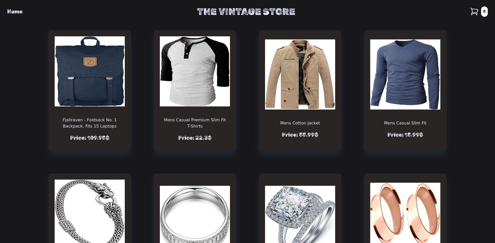

# Shopping Cart

Online clothing shopping cart implemented using React.js and Tailwind CSS.

#### You can have a look at the result <a href='https://budy6991.github.io/shopping-cart'>here </a>

All the cart data is managed from a main component which then gets upated by methods passed down to the children components.

Therefore all can be updated constantly from selecting a product to editing or remove it on the check out of the cart.
